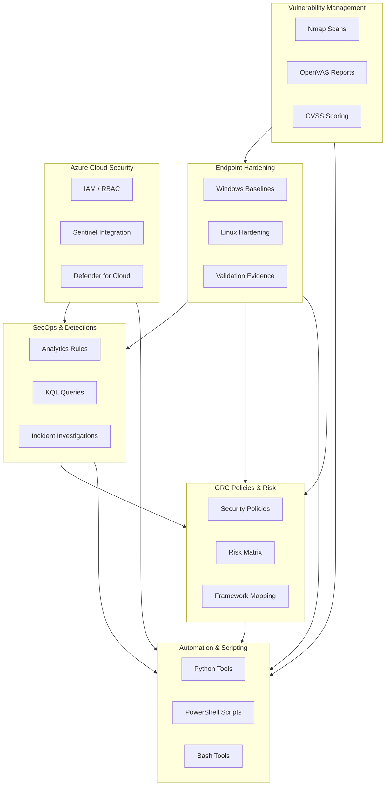

## Hi, I'm Kevin - Security Analyst & Blue Team Builder

I’m an aspiring Cybersecurity Professional focused on Detection Engineering, Cloud Security, GRC, and Automation.
I learn by building real labs and solving real problems — everything in my GitHub is hands-on, documented, and built from scratch.

I’m currently developing a full Blue Team portfolio with real SecOps workflows across Microsoft Sentinel, Azure, Sysmon, OpenVAS, PowerShell, Python, Bash, and industry security frameworks.

## Featured Security Projects (6-Repo Portfolio)

    

**1. SecOps & Detection Engineering (Microsoft Sentinel)**

Detection rules, KQL analytics, incidents, and log analysis in a full SIEM mini-lab.
🔗 https://github.com/kvntynito/1-secops-detentions-sentinel

**2. Vulnerability Management (Nmap / OpenVAS)**

Network scanning, vulnerability assessments, risk scoring, and remediation planning.
🔗 https://github.com/kvntynito/2-vuln-mgmt-openvas-lab

**3. Endpoint Hardening (Windows & Linux)**

Secure baselines, configuration changes, validation scripts, and evidence collection.
🔗 https://github.com/kvntynito/3-endpoint-hardening-windows-linux

**4. Azure Cloud Security Mini-Lab**

Sentinel, Defender for Cloud, IAM/RBAC reviews, Secure Score, and architecture mapping.
🔗 https://github.com/kvntynito/4-azure-security-mini-lab

**5. Governance, Risk & Compliance (GRC)**

Policies, risk matrices, framework mapping, and governance documentation.
🔗 https://github.com/kvntynito/5-grc-policies-and-risk

**6. Cybersecurity Automation (Python / PowerShell / Bash)**

Log parsers, enrichment tools, Windows/Linux auditing, and automated detection scripts.
🔗 https://github.com/kvntynito/6-sec-automation-py-ps-bash

## 🧠 Skills & Focus Areas

**Blue Team / SecOps**
- Detection engineering (KQL, analytics, MITRE ATT&CK)
- Incident investigation workflows
- Sysmon, Windows Event Logs, Linux auditing

**Security Engineering**
- Endpoint hardening (Windows + Linux)
- Azure identity & resource security
- Network segmentation w/ pfSense

**Vulnerability & Risk**
- Nmap + OpenVAS scanning
- CVSS scoring & risk matrices
- Governance documentation

**Scripting & Automation**
- Python log parsing & enrichment
- PowerShell evidence collection
- Bash auditing & system checks

## 📚 Currently Learning

- Azure Identity Protection
- SOAR automation using Logic Apps
- Detection engineering best practices
- NIST & ISO27001 alignment

## 🎯 Career Goal

To become a Security Analyst / Blue Team Engineer contributing to real-world detection engineering, incident response, and cloud security operations.
